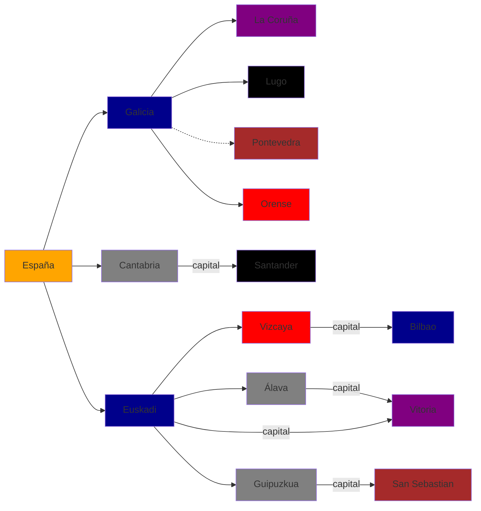

# Hola
texto cualquiera

## sección
Ejemplo de texto

```mermaid
graph LR

E[España] --> G[Galicia]
E --> C[Cantabria]
E --> EUS[Euskadi]
G --> 1[La Coruña] 
G --> 2[Lugo]
G -.-> 3[Pontevedra] 
G --> 4[Orense] 
C --capital --> S[Santander]

EUS[Euskadi] --> V[Vizcaya]
EUS --> A[Álava] --capital--> VT[Vitoria]
EUS --capital--> VT
EUS --> GUI[Guipuzkua]
GUI --capital--> SAN[San Sebastian]
V --capital--> BIO[Bilbao]


style G fill:darkblue
style 1 fill:purple
style EUS fill:blue
style 2 fill:black
style 3 fill:brown
style 4 fill:red
style E fill:orange
style C fill:grey
style EUS fill:darkblue
style S fill:black
style SAN fill:brown
style VT fill:purple
style V fill:red
style E fill:orange
style GUI fill:grey
style BIO fill:darkblue
style A fill:grey


```

```mermaid

graph TD
 


```

:::mermaid
pie
title Un gráfico de sectores
"Segmento A":25
"Segmento B":75

:::
