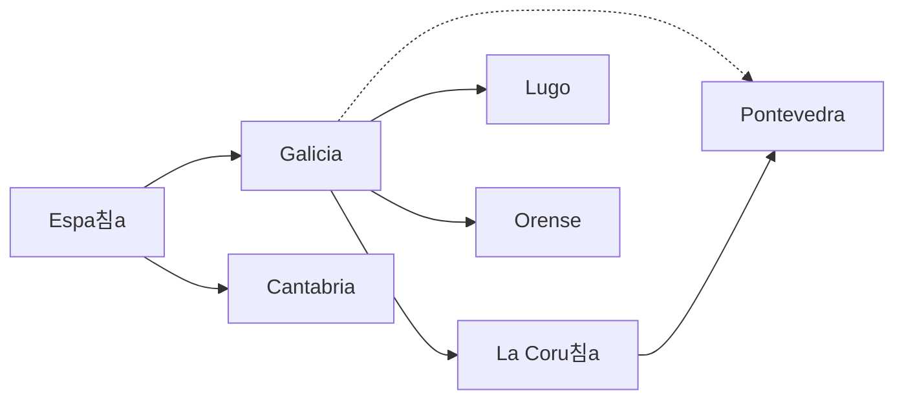
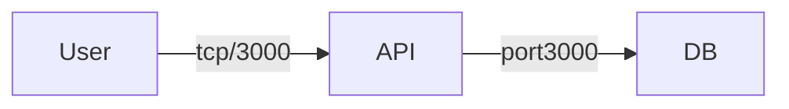

# Hola
texto cualquiera

## secci칩n
Ejemplo de texto

```mermaid
graph LR

Galicia --> 1[La Coru침a] 
Galicia --> 2[Lugo]
Galicia -.-> 3[Pontevedra] 
Galicia --> 4[Orense] 
Espa침a --> Galicia
Espa침a --> Cantabria

1 --> 3
```

```mermaid
graph LR
 User --tcp/3000--> API --port3000--> DB
```
